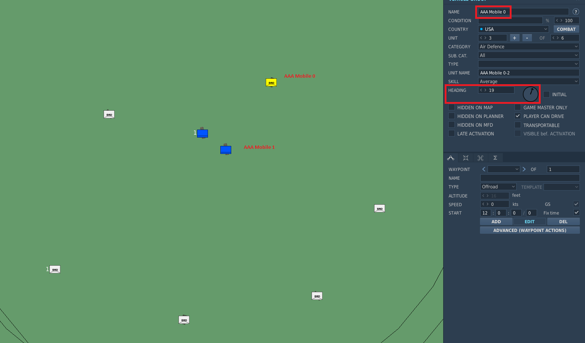

# ArmedForces and the Layout System

Armed Forces and the Layout System is a complete rework of the generator-based logic to build theater-ground-objects (Liberation Objects which group ground units).
This will change underlying parts of the code base which will allow major improvements to the Ground Warfare in upcoming features. 

**Armed Forces**\
TODO Describe the introduction of ArmedForces which are similar to the AirWing and Squadrons.
The armed forces of each coalition contain multiple ForceGroups. A ForceGroup is a logical set of units (Vehicles, Ships, Statics) and corresponding Layouts for these units. 

TODO Picture / Example to describe what it is... for example with Hawk Battery or S-300 Battery

**The Layout System**\
In the previous system the generator was written in python and generated a group with a defined and static logic, written in code.
The layout sytem will now decouple the alignment / positioning from units and the definition of theire actual type (like Ural-375).
The template system allows to define the layout and set which unit types or classes (All logistic units for example) are able to fit into the template.
Ultimately this will allow to have generalized templates which can be reused by multiple types of units. Best example is the definition of a SAM layout.
Previously we had a generator for every different SAM Site, now we can just reuse the alignemnt (e.g. 6 Launchers in a circle alignment) with more generalization.

This also allows Users and Designers to easily create or modify templates as the new templates are defined with the DCS Mission editor and an additional .yaml file which provides mapping information.
In total the new system reduces the complexity and allows to precisely align / orient units as needed and create realistic looking ground units.
As the whole ground unit generation and handling was reworked it is now also possible to add static units to a ground object, so even Fortifcation or similar can be added to templates in the future.

## General Concept


TODO: Describe the general flow of the Template system

TODO: Describe the serialization (Developer Tools: Import Templates)

TODO Lifecycle:
The template will be automatically validated on campaign generation against the player and enemy factions. 
If the factions support the template (based on the unit_types and unit_classes) then it will be added to the game.
If a faction does not support a group from the template it will be removed if optional == True otherwise the complete template will be marked as unsupported and will not be used for the game.
During campaign initialization the start_generator will request unit_groups for the preset locations defined by the campaign designer. The faction will then offer possible groups and the matching template.
The Liberation Group (TheaterGroundObject) is then being generated from this UnitGroup.

- GroundWar (Frontline) currently does **not** use the template system
- User can buy new SAM or ArmorGroup using this template system
- Campaign Designers can also define precicsly (if needed) which template or UnitGroup should be placed at a specific location by using TriggerZones with custom properties

Example for a customized Ground Object Buy Menu which makes use of Templates and UnitGroups:


### The template miz

*Important*: Every unit_type has to be in a separate Group for the template to work. 
The template system merges the groups back together later with the group_id property (defaults to 1 which means that all groups in the template will be merged to group 1)

The function of the miz is to have the positioning and alignment of all the units within the template. Coordinates and headings will be used for the generated group.

Unit Count per group has to be the amount set with the unit_count property.

During template generation the system will go through all possible units and will assign the respective unit_type to the units up to the maximum allow unit_count from the mapping.



### The template yaml

Possible Information:

| Property      | Type                  | Required | Description                                                                                                    | Example                                                                   |
|---------------|-----------------------|----------|----------------------------------------------------------------------------------------------------------------|---------------------------------------------------------------------------|
| Name          | (str)                 | Yes      | A name to identify the template                                                                                | `name: Armor Group`                                                       |
| Role          | (GroupRole)           | Yes      | The role which the template should fit in                                                                      | `role: AntiAir` or `role: GroundForce`                                    |
| Tasks         | (list of GroupTask)   | Yes      | A list of tasks which the template can fullfill                                                                | `tasks:  - AAA  - SHORAD`                                                 |
| Generic       | (bool, default False) | No       | If this is true this template will be used to create general unitGroups                                        |                                                                           |
| Description   | (str)                 | No       | Short description of the template                                                                              |                                                                           |
| category      | (str)                 | No       | Only used for building templates to identify the type of the building                                          | `category: ammo`                                                          |
| Groups        | (list of Groups)      | Yes      | see below for definition of a group                                                                            |                                                                           |
| template_file | (str)                 | No       | the .miz file which has the template included. Only needed if the file has a different name than the yaml file | `template_file: resources/templates/anti_air/legacy_ground_templates.miz` |

Groups within the template are defined as following:

| Property     | Type                   | Required | Description                                                                                                                                                                           | Example |
|--------------|------------------------|----------|---------------------------------------------------------------------------------------------------------------------------------------------------------------------------------------|---------|
| name         | (str)                  | Yes      | The group name used in the .miz. Must match exactly!                                                                                                                                  |         |
| optional     | (bool, default: False) | No       | Defines wether the template can be used without this group if the faction has no access to the unit type or the user wants to disable this group                                      |         |
| group        | (int, default: 1)      | No       | The ID of the group which the templategroup will be merged into                                                                                                                       |         |
| unit_count   | (list of int)          | No       | Amount of units to be generated for this group. Can be fixed or a range where it will be picked randomly                                                                              |         |
| unit_types   | (list dcs unit types)  | No       | Specific unit_types for ground units. Complete list from pydcs: [Vehicles.py](https://github.com/pydcs/dcs/blob/master/dcs/vehicles.py). This list is extended by all supported mods! |         |
| unit_classes | (list unit classes)    | No       | Unit_classes of supported units. Defined in [UnitClass](/game/data/units.py)                                                                                                          |         |
| statics      | (list static types)    | No       | Specific unit_types of statics. Complete list from pydcs: [Statics.py](https://github.com/pydcs/dcs/blob/master/dcs/statics.py)                                                       |         |

Complete example of a generic template for AAA Groups:

```
name: AAA Site
description: A standard AAA template
generic: true
role: AntiAir
tasks:
  - AAA
groups:
  - name: AAA Site 0
    group: 1
    unit_count:
      - 2
      - 6
    unit_classes:
      - AAA
  - name: AAA Site 1
    optional: true
    group: 1
    unit_count:
      - 1
      - 2
    unit_classes:
      - Logistics
template_file: resources/templates/anti_air/AAA.miz
```

### Roles, Tasks and Classes

TODO Describe Role, Tasking and Classes

[GroupRole and GroupTask](/game/data/groups.py)

[UnitClass](/game/data/units.py)

## How to add / modify a template

A template consists of two special files:

- template.miz which defines the actual positioning and alignment of the groups / units
- template.yaml which defines the necessary information like amount of units, possible types or classes.

To add a new template a new yaml has to be created as every yaml can only define exact one template. Best practice is to copy paste an existing template which is similar to the one to be created as starting point. The next step is to create a new .miz file and align Units and statics to the wishes. Even if existing ones can be reused, best practice is to always create a fresh one to prevent side effects.
The most important part is to use a new Group for every different Unit Type. It is not possible to mix Unit Types in one group within a template. For example it is not possible to have a logistic truck and a AAA in the same group. The miz file will only be used to get the exact position and orientation of the units, therefore it is irrelevant which type of unit will be used. The unit type will be later defined inside the yaml file.
For the next step all Group names have to be added to the yaml file. Take care to that these names match exactly! Assign the unit_types or unit_classes properties to math the needs.

TODO Improve this with images and more detailed description

**IMPORTANT**: Due to performance increase the templates get serialized to a pickle file in the save dir as `templates.p`. When templates were modified a manual re-import of all templates has to be triggered.
This can be done by either deleting this file or using the Liberation UI. There is a special option in the ToolBar under Tools: Import Templates.


## Import Layouts into Liberation
TODO Describe the serialization and import.

For performance improvements all layouts are serialized to a so called pickle file. Every time changes are made to the layouts this file has to be recreated.
It will also be recreated after each Liberation update as it will check the Version Number and recreate it when changes are recognized.

This file is stored in the save folder


## Migration from Generators

- All generators removed and migrated to templates
- These templates will in the next step be generalized

The previous generators were migrated using a script which build a group using the generator. All of these groups were save into one .miz file [original_generator_layouts.miz](/resources/layouts/original_generator_layouts.miz).
This miz file can be used to verify the templates and to generalize similar templates to decouple the layout from the actual units. As this is a time-consuming and sphisticated task this will be done over time.
With the first step the technical requirements will be fulfilled so that the generalization can happen afterwards the technical pr gets merged.


### Updates for Factions

With the rework there were also some changes to the faction file definitions. Older faction files can not be loaded anymore and have to be adopted to the new changes.
During migration all default factions were automatically updated, so they will work out of the box.

What was changed:
- Removed the `ewrs` list. All EWRs are now defined in the list "air_defense_units".
- Added the `air_defense_units` list. All units with the Role AntiAir can be defined here as [GroundUnitType](/game/dcs/groundunittype.py). All possible units are defined in [/resources/units/ground_units](/resources/units/ground_units)
- Added `preset_groups`. This list allows to define Preset Groups (described above) like SAM Systems consisting of Launcher, SR, TR and so on instead of adding them each to "air_defense_units". The presets are defined in [/resources/units/unit_groups](/resources/units/groups)
- Migrated `air_defenses` to air_defense_units and preset_sets.
- `Missiles` are migrated to GroundUnitTypes instead of Generator names (see air_defense_units for how to use)
- Removed `cruisers`, `destroyers` and `naval_generators`. Migrated them to naval_units and preset_groups
- added `naval_units` with the correct ship name found here [/resources/units/ships](/resources/units/ships)
- `aircraft_carrier` and `helicopter_carrier` were moved to `naval_units` as well.

## Unit Groups

TODO Explain more

- Sum up groups of different units which are used together (like a sam site).
- UnitGroup allows to define this logical group and add this to the faction file.
- UnitGroups can have preferred templates

Example:

```
name: SA-10/S-300PS  # The name which will be used in the faction file
role: AntiAir  # The role of the Group
tasks:
  - LORAD  # The task the Group can fulfill
ground_units:
  - SAM SA-10 S-300 "Grumble" Clam Shell SR
  - SAM SA-10 S-300 "Grumble" Big Bird SR
  - SAM SA-10 S-300 "Grumble" C2
  - SAM SA-10 S-300 "Grumble" Flap Lid TR
  - SAM SA-10 S-300 "Grumble" TEL D
  - SAM SA-10 S-300 "Grumble" TEL C
ship_units:
  - # Add some naval units here
statics:
  - # Add some statics here
templates:
  - S-300 Site  # The template names which should be used by this group
  ```

A list of all available units is accessible here: [/resources/units/unit_groups](/resources/units/groups)


### Optional Tasks which can be done later
- [ ] Complex Presets which allow campaign designer to specify the exact forcegroup or layout which should be used.
- [ ] Generalize all layouts (Like MERAD or SHORAD templates)
- [ ] Reuse the layouts for the frontline
- [ ] Add UI Implementation to choose which templates should be used during new game wizard (like AirWing Config)
- [ ] Rework "Names_By_Category" to just use the Tasking instead of a string.
- [ ] Add remaining missing classes to the units which currently dont have a class


