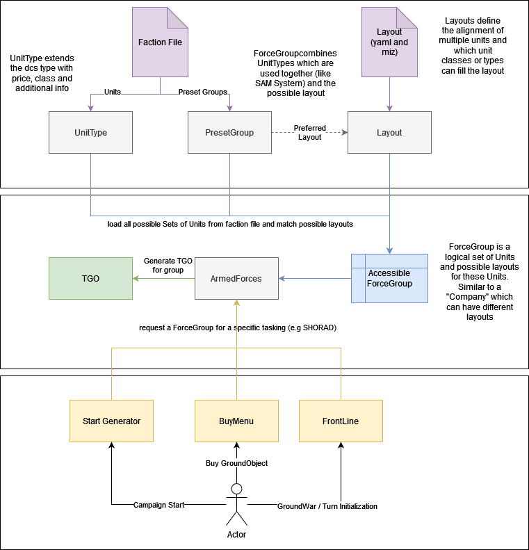
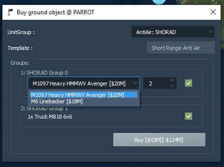
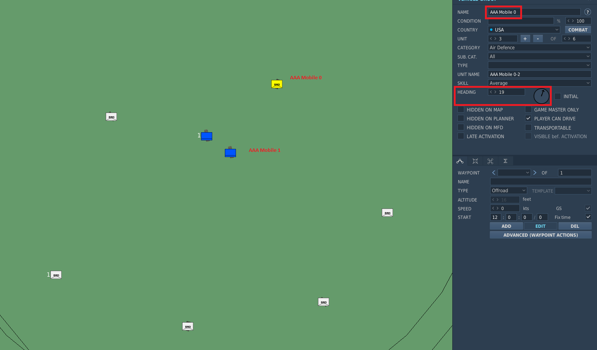

The Layout System
=================

.. note::
    The documentation of the layout system is still WIP and not
    complete as the development of this feature involves a major refactoring
    of the base code. Therefore this documentation is currently used for
    development purpose primarily. The documentation will be updated soon.
    Any help in updating this wiki page is appreciated!

The Layout System is a new way of defining how ground objects like SAM
Sites or other Vehicle / Ship Groups will be generated (which type of
units, how many units, alignment and orientation). It is a complete
rework of the previous generator-based logic which was written in python
code. The new system allows to define layouts with easy to write yaml
code and the use of the DCS Mission Editor for easier placement of the
units. The layout system also introduced a new logical grouping of Units
and layouts for them, the Armed Forces, which will allow major
improvements to the Ground Warfare in upcoming features.

**Armed Forces**

The Armed Forces is a new system introduced with the layout system which will
allow to identitfy and group possible units from the faction together with
available layouts for these groups. It is comparable to the AirWing and Squadron
implementation but just for Ground and Naval Forces. All possible Force Groups
(grouping of 1 or more units and and the available layouts for them) will be
generated during campaign initialization and will be used later by many
different systems. A Force Group can also include static objects which was not
possible before the introduction of the layout system. It is also possible to
define presets of these Force Groups within the faction file which is handy for
more complex groups like a SA-10 Battery or similar. Example: `SA-10.yaml`_.
which includes all the units like SR, TR, LN and has the layout of a
`S-300_Site.yaml`_.

.. _SA-10.yaml: https://github.com/dcs-liberation/dcs_liberation/blob/develop/resources/groups/SA-10.yaml
.. _S-300_Site.yaml: https://github.com/dcs-liberation/dcs_liberation/blob/develop/resources/layouts/anti_air/S-300_Site.yaml

**The Layout System**

In the previous system the generator which created the ground object was written
in python which made modifications and reusability very complicated. To allow
easier handling of the layouts and decoupling of alignment of units and the
actual unit type (for example Ural-375) the layout system was introduced.
Previously we had a generator for every different SAM Site, now we can just
reuse the alignemnt (e.g. 6 Launchers in a circle alignment) for multiple SAM
Systems and introduce more variety.

This new System allows Users and Designers to easily create or modify
layouts as the new alginment and orientation of units is defined with
the DCS Mission editor. An additional .yaml file allows the
configuration of the layout with settings like allow unit types or
random amounts of units. In total the new system reduces the complexity
and allows to precisely align / orient units as needed and create
realistic looking ground units.

As the whole ground unit generation and handling was reworked it is now
also possible to add static units to a ground object, so even
Fortifcation or similar can be added to templates in the future.

General Concept
~~~~~~~~~~~~~~~

   Overview

All possible Force Groups will be generated during campaign
initialization by checking all possible units for the specific faction
and all available layouts. The code will automatically match general
layouts with available units. It is also possible to define preset
groups within the faction files which group many units and the prefered
layouts for the group. This is especially handy for unique layouts which
are not defined as ``global``. For example complex sam sites like the
S-300 or Patriot which have very specific alignment of the different
units.

Layouts will be matched to units based on the special definition given
in the corresponding yaml file. For example a layout which is defined as
global and allows the unit_class SHORAD will automatically be used for
all available SHORAD units which are defined in the faction file.

.. todo:: Describe the optional flag.

All these generated ForceGroups will be managed by the ArmedForces class
of the specific coalition. This class will be used by other parts of the
system like the start_generator or the BuyMenu. The ArmedForces class
will then generate the TheaterGroundObject which will be used by
liberation.

Example for a customized Ground Object Buy Menu which makes use of
Templates and UnitGroups:

   Ground object buy menu

How to modify or add layouts
----------------------------

.. warning::
    Whenever changes were made to layouts they have to be re-imported into
    Liberation. See :ref:`Import Layouts into Liberation`.

A layout consists of two special files:

-  layout.miz which defines the actual positioning and alignment of the
   groups / units
-  layout.yaml which defines the necessary information like amount of
   units, possible types or classes.

To add a new template a new yaml has to be created as every yaml can
only define exact one template. Best practice is to copy paste an
existing template which is similar to the one to be created as starting
point. The next step is to create a new .miz file and align Units and
statics to the wishes. Even if existing ones can be reused, best
practice is to always create a fresh one to prevent side effects. The
most important part is to use a new Group for every different Unit Type.
It is not possible to mix Unit Types in one group within a template. For
example it is not possible to have a logistic truck and a AAA in the
same group. The miz file will only be used to get the exact position and
orientation of the units, therefore it is irrelevant which type of unit
will be used. The unit type will be later defined inside the yaml file.
For the next step all Group names have to be added to the yaml file.
Take care to that these names match exactly! Assign the unit_types or
unit_classes properties to math the needs.

The Layout miz
~~~~~~~~~~~~~~

The miz file is used to define the positioning and orientation of the
different units for the template. The actual unit which is used is
irrelevant. It is important to use a unique and meaningful name for the
groups as this will be used in the yaml file as well. The information
which will be extracted from the miz file are just the coordinates and
heading of the units.

*Important*: Every different unit type has to be in a separate Group for
the template to work. You can not add units of different types to the
same group. They can get merged back together during generation by
setting the group property. In the example below both groups
``AAA Site 0`` and ``AAA Site 1`` have the group = 1 which means that
they will be in the same dcs group during generation.

*Important*: Liberation expects every template to be designed with an
orientation of heading 0 (North) in mind. The complete GroundObject will
during the campaign generation process be rotated to match the
orientation defined by the campaign designer. If the layout was not
created with an orientation of heading 0 the later generated
GroundObject will likely be misaligned and not work properly.

.. todo::
    max amount of possible units is defined from the miz. Example if later the
    group should have 6 units than there have to be 6 defined in the miz.

   Example template mission

The Layout configuration file
~~~~~~~~~~~~~~~~~~~~~~~~~~~~~

.. todo:: Description about the layout yaml file.

Possible Information:

.. list-table::
    :header-rows: 1

    * - Property
      - Type
      - Required
      - Description
      - Example
    * - name
      - ``str``
      - Yes
      - A name to identify the template
      - .. code:: yaml

           name: Armor Group
    * - tasks
      - list of ``GroupTask``
      - Yes
      - A list of tasks which the template can fulfill
      - .. code:: yaml

           tasks:
             - AAA
             - SHORAD
    * - generic
      - ``bool``, default false
      - No
      - True if this template will be used to create general ``UnitGroups``
      -
    * - description
      - ``str``
      - No
      - Short description of the template
      -
    * - groups
      - List of ``Groups``
      - Yes
      - See below for definition of a group
      -
    * - layout_file
      - ``str``
      - No
      - The .miz file which has the groups/units of the layout included. Only
        needed if the file has a different name than the yaml file
      - .. code:: yaml

           layout_file: resources/layouts/naval/legacy_naval_templates.miz

.. todo:: Group and SubGroup

A group has 1..N sub groups. The name of the Group will be used later
within the DCS group name.

All SubGroups will be merged into one DCS Group

Every unit type has to be defined as a sub group as following:

.. list-table::
    :header-rows: 1

    * - Property
      - Type
      - Required
      - Description
    * - name
      - ``str``
      - Yes
      - The group name used in the .miz. Must match exactly!
    * - optional
      - ``bool``, default: false
      - No
      - Defines wether the layout can be used without this group if the faction
        has no access to the unit type or the user wants to disable this group
    * - fill
      - ``bool``, default: false
      - No
      - If the group is optional the layout is used from a PresetGroup this
        property tells the system if it should use any possible faction
        accessible unit to fill up this slot if no capable one was defined in
        the preset yaml.
    * - unit_count
      - list of ``int``
      - No
      - Amount of units to be generated for this group. Can be fixed or a range
        where it will be picked randomly
    * - unit_types
      - list of DCS unit type IDs
      - No
      - Specific unit_types for ground units. Complete list from `vehicles.py`_.
        This list is extended by all supported mods!
    * - unit_classes
      - list of unit classes
      - No
      - Unit classes of supported units. Defined by ``UnitClass`` in
        `game/data/units.py`_.
    * - statics
      - list of static types
      - No
      - Specific unit_types of statics. Complete list from `statics.py`_

.. _vehicles.py: https://github.com/pydcs/dcs/blob/master/dcs/vehicles.py
.. _game/data/units.py: https://github.com/dcs-liberation/dcs_liberation/blob/develop/game/data/units.py
.. _statics.py: https://github.com/pydcs/dcs/blob/master/dcs/statics.py

Complete example of a generic template for an Aircraft Carrier group:

.. code:: yaml

   name: Carrier Group
   generic: true
   tasks:
     - AircraftCarrier
   groups:
     - Carrier: # Group Name of the DCS Group
       - name: Carrier Group 0 # Sub Group used in the layout.miz
         unit_count:
           - 1
         unit_classes:
           - AircraftCarrier
     - Escort: # Group name of the 2nd Group
       - name: Carrier Group 1
         unit_count:
           - 4
         unit_classes:
           - Destroyer
   layout_file: resources/layouts/naval/legacy_naval_templates.miz

Import Layouts into Liberation
~~~~~~~~~~~~~~~~~~~~~~~~~~~~~~

For performance improvements all layouts are serialized to a so called
pickle file inside the save folder defined in the liberation
preferences. Every time changes are made to the layouts this file has to
be recreated. It can be recreated by either deleting the layouts.p file
manually or using the special option in the Liberation Toolbar
(Developer Tools -> Import Layouts). It will also be recreated after
each Liberation update as it will check the Version Number and recreate
it when changes are recognized.

Migration from Generators
-------------------------

The previous generators were migrated using a script which build a group using
the generator. All of these groups were save into one .miz file
`original_generator_layouts.miz`_. This miz file can be used to verify the
templates and to generalize similar templates to decouple the layout from the
actual units. As this is a time-consuming and sphisticated task this will be
done over time. With the first step the technical requirements will be fulfilled
so that the generalization can happen afterwards the technical pr gets merged.

.. _original_generator_layouts.miz: https://github.com/dcs-liberation/dcs_liberation/blob/develop/resources/layouts/original_generator_layouts.miz

Updates for Factions
~~~~~~~~~~~~~~~~~~~~

With the rework there were also some changes to the faction file
definitions. Older faction files can not be loaded anymore and have to
be adopted to the new changes. During migration all default factions
were automatically updated, so they will work out of the box.

You can find more detailed information about how to customize the
faction file in `Custom factions`_.

What was changed:

* Removed the ``ewrs`` list. All EWRs are now defined in the list
  ``air_defense_units``.
* Added the ``air_defense_units`` list. All units with the Role AntiAir can be
  defined here as `GroundUnitType`_. All possible units are defined in
  `resources/units/ground_units`_.
* Added ``preset_groups``. This list allows to define Preset Groups (described
  above) like SAM Systems consisting of Launcher, SR, TR and so on instead of
  adding them each to “air_defense_units”. The presets are defined in
  `resources/groups`_
* Migrated ``air_defenses`` to air_defense_units and preset_sets.
* ``Missiles`` are migrated to GroundUnitTypes instead of Generator names (see
  air_defense_units for how to use)
* Removed ``cruisers``, ``destroyers`` and ``naval_generators``. Migrated them
  to naval_units and preset_groups
* Added ``naval_units`` with the correct ship name found in
  `resources/units/ships`_.
* ``aircraft_carrier`` and ``helicopter_carrier`` were moved to ``naval_units``
  as well.

.. _Custom factions: https://github.com/dcs-liberation/dcs_liberation/wiki/Custom-Factions
.. _GroundUnitType: https://github.com/dcs-liberation/dcs_liberation/blob/develop/game/dcs/groundunittype.py
.. _resources/units/ground_units: https://github.com/dcs-liberation/dcs_liberation/blob/develop/resources/units/ground_units
.. _resources/units/ships: https://github.com/dcs-liberation/dcs_liberation/blob/develop/resources/units/ships
.. _resources/groups: https://github.com/dcs-liberation/dcs_liberation/blob/develop/resources/groups

Preset Groups
-------------

Instead of adding the exact name of the previous generator to add
complex groups like SAM sites or similar to the faction it is now
possible to add preset groups to the faction file. As described earlier
such a preset group (Force Group) can be defined very easy with a yaml
file. This file allows to define the name, tasking, units, statics and
the prefered layouts. The first task defines the primary role of the
ForceGroup which gets generated from the preset.

Example:

.. code:: yaml

   name: SA-10/S-300PS  # The name of the group
   tasks: # Define at least 1 task
     - LORAD  # The task(s) the Group can fulfill
   units: # Define at least 1 unit
     - SAM SA-10 S-300 "Grumble" Clam Shell SR
     - SAM SA-10 S-300 "Grumble" Big Bird SR
     - SAM SA-10 S-300 "Grumble" C2
     - SAM SA-10 S-300 "Grumble" Flap Lid TR
     - SAM SA-10 S-300 "Grumble" TEL D
     - SAM SA-10 S-300 "Grumble" TEL C
   statics: # Optional
     - # Add some statics here
   layouts: # Define at least one layout
     - S-300 Site  # prefered layouts for these groups

Resources:

* A list of all available preset groups can be found here: `resources/groups`_
* All possible tasks can be found in the `game/data/groups.py`_
* Units are defined with the variant name found in `resources/units`_

.. _game/data/groups.py: https://github.com/dcs-liberation/dcs_liberation/blob/develop/game/data/groups.py
.. _resources/units: https://github.com/dcs-liberation/dcs_liberation/tree/develop/resources/units