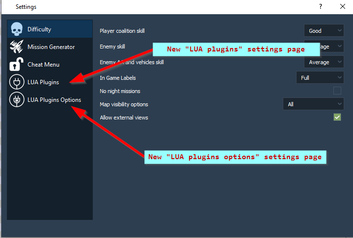
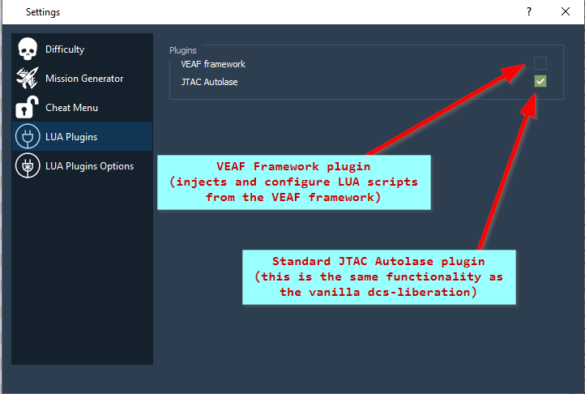
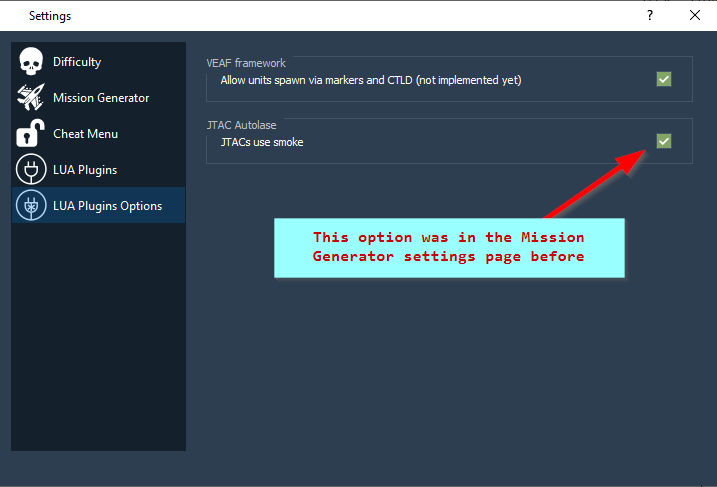

# LUA Plugin system

This plugin system was made for injecting LUA scripts in dcs-liberation missions.

The resources for the plugins are stored in the `resources/plugins` folder ; each plugin has its own folder.

## How does the system work ?

The application first reads the `resources/plugins/plugins.json` file to get a list of plugins to load, in order.
Each entry in this list should correspond to a subfolder of the `resources/plugins` directory, where a `plugin.json` file exists.
This file is the description of the plugin.

### plugin.json

The *base* and *jtacautolase* plugins both are included in the standard dcs-liberation distribution.
You can check their respective `plugin.json` files to understand how they work.
Here's a quick rundown of the file's components :
 
- `skipUI` : if *true*, this plugin will not appear in the plugins selection user interface. Useful to force a plugin ON or OFF (see the *base* plugin)
- `nameInUI` : the title of the plugin as it will appear in the plugins selection user interface.
- `defaultValue` : the selection value of the plugin, when first installed ; if true, plugin is selected.
- `specificOptions` : a list of specific plugin options
  - `nameInUI` : the title of the option as it will appear in the plugins specific options user interface.
  - `mnemonic` : the short, technical name of the option. It's the name of the LUA variable passed to the configuration script, and the name of the option in the application's settings 
  - `defaultValue` : the selection value of the option, when first installed ; if true, option is selected.
- `scriptsWorkOrders` : a list of work orders that can be used to load or disable loading a specific LUA script
  - `file` : the name of the LUA file in the plugin folder.
  - `mnemonic` : the technical name of the LUA component. The filename may be more precise than needed (e.g. include a version number) ; this is used to load each file only once, and also to disable loading a file
  - `disable` : if true, the script will be disabled instead of loaded
- `configurationWorkOrders` : a list of work orders that can be used to load a configuration LUA script (same description as above)

## Standard plugins

### The *base* plugin

The *base* plugin contains the scripts that are going to be injected in every dcs-liberation missions.
It is mandatory.

### The *JTACAutolase* plugin

This plugin replaces the vanilla JTAC functionality in dcs-liberation.

### Known third-party plugins

Plugins not included with Liberation can be installed by adding them to the
`resources/plugins` directory and listing them in
`resources/plugins/plugins.json`. Below is a list of other plugins that can be
installed:

* [VEAF](https://github.com/VEAF/dcs-liberation-veaf-framework)

## Custom plugins

The easiest way to create a custom plugin is to copy an existing plugin, and modify the files.

## New settings pages

Custom plugins can be enabled or disabled in the new *LUA Plugins* settings page.

For plugins which expose specific options (such as "use smoke" for the *JTACAutoLase* plugin), the *LUA Plugins Options* settings page lists these options.

